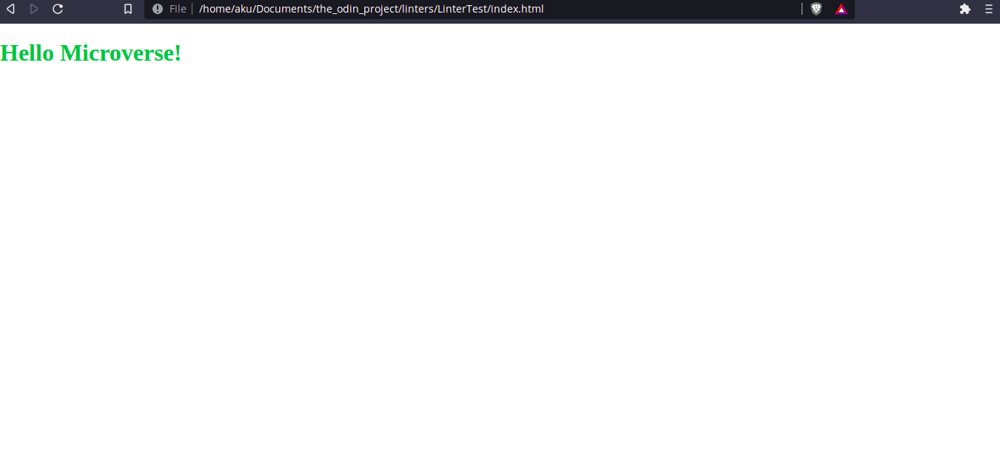

# Hello Microverse

> This project is about Hello Microverse repository. Contains one HTML and one CSS page.

Coding project about gitworkflow.

## Built With

- Html/CSS
- Linters(html/css)

## Authors

👤 **Aku**

- GitHub: [@aakbarkhan](https://github.com/aakbarkhan)

## 🤝 Contributing

Contributions, issues, and feature requests are welcome!

Feel free to check the [issues page](../../issues/).

## Show your support

Give a ⭐️ if you like this project!

## Acknowledgments

- My coding partners.
- My morning session team.
- My standup team.

## 📝 License

This project is [MIT](./MIT.md) licensed.
